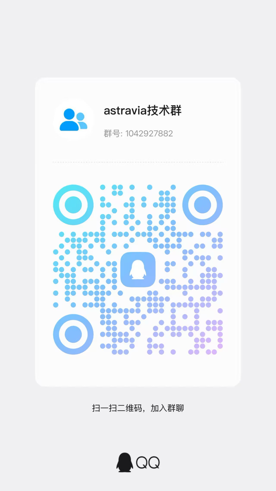

<div align="center">
  
  <p><strong>Astravia</strong> — A local-first open-source AI desktop assistant: coding, documents, data, automation — one app for all of it.</p>
  <p>No cloud, no account, no telemetry. Your data and keys never leave your machine.</p>
  <p><a href="README.md">简体中文</a> · <b>English</b></p>
</div>

---

## Table of Contents

- [Features](#features)
- [Quick Start](#quick-start)
- [Feature Overview](#feature-overview)
- [Plugin System](#plugin-system)
- [Architecture](#architecture)
- [Model Configuration](#model-configuration)
- [Network Behavior](#network-behavior)
- [Installation](#installation)
- [Contributing](#contributing)
- [Join the Community](#join-the-community)
- [Credits](#credits)
- [License](#license)

## Features

Astravia is an open-source AI desktop agent: the agent core — coding, documents, automation, creative work — in a desktop product, built around one principle: **you work locally, so your data stays local**.

- **No cloud**: no login, no account, no subscription. Bring your own model keys (BYOK): requests go straight to the provider you pick, keys live only in your OS keychain.
- **No telemetry**: no crash reports, no usage statistics; every outbound request is explicitly triggered by your configuration (see [Network Behavior](#network-behavior)).
- **Data on your machine**: sessions, workspaces, the knowledge base and database connections live under `~/.astravia` by default, and don't leave your machine.

## Quick Start

1. Download the installer for your platform from [Releases](../../releases) (macOS / Windows / Linux).
2. In Settings, pick a model provider and enter your own key.
3. Create a project and start a conversation: write code, tidy up documents, work on files.
4. When you need data, add a database connection (pick a file for SQLite; fill in server info for PostgreSQL / MySQL), then query in the "Database" tab — or just ask the AI to run the query.
5. Hand repetitive work to batch and scheduled tasks, and get notified via Feishu / DingTalk bots when they finish.

## Feature Overview

Every capability is part of the app, on equal footing — nothing requires installing an extra client or leaning on an external service.

| Capability | What it does |
| --- | --- |
| **Conversation & workspace** | Message stream, tool-call progress and generated artifacts on one screen; sessions organized by project in the sidebar; the activity panel shows tool calls and progress in real time. Files preview in-app (PDF, Word, PPT, spreadsheets, images, audio, video, SVG), and scanned PDFs can be OCR'd offline. |
| **Database** | Built-in connection management and a SQL workbench: table browsing, multiple query tabs, history, CSV/JSON export and data editing. The AI can query for you — table schemas are injected on demand (the switch is off by default) and results come back as tables. Write operations need graded authorization, `prod` connections are read-only by default, and row limits and timeouts are configurable. The engine is a self-built binary based on [dbx](https://github.com/t8y2/dbx) (Apache-2.0), shipped with the app, supporting 40+ database types (SQLite, PostgreSQL, MySQL, SQL Server, Oracle, MongoDB, Redis, ClickHouse, DuckDB, Snowflake, BigQuery, …). |
| **Batch tasks** | One prompt across many directories; tasks are organized as "projects + tasks", each runnable and retryable, with progress visible live. |
| **Scheduling** | A built-in cron scheduler; tasks run quietly from the tray, with execution history. |
| **Notifications & remote control** | Batch / scheduled completion or failure pushed to Feishu / DingTalk bots (credentials stored encrypted); remote-control your local agent from IM on your phone — Feishu first (Telegram and DingTalk planned), powered by the embedded `im-gateway` sidecar which starts and stops with the app. |
| **Ecosystem** | The marketplace installs skills, MCP servers, plugins and bundles from any GitHub repository (search runs against a local snapshot); skills turn a way of working into a reusable capability; MCP tools become visible to the agent automatically; plugins enable and disable on demand; themes swap the whole look; local documents are processed into a searchable knowledge base the agent can cite — all of it stays on your machine. |
| **UI design workspace** | Mockups on an infinite canvas where frames are real, runnable interfaces; a design shares one color system, and frames export as render images or read-only share packages. |
| **Desktop integration** | A global hotkey summons the quick panel; on macOS, Appshot captures the frontmost window (screenshot, title, on-screen text) in one gesture and hands it to the agent; environment settings configure Node / Python runtimes; tray residency, auto-update and a bilingual UI round it out. |

## Plugin System

Plugins are not an afterthought — the design canvas, content creation, Git, charts and the file previewers are themselves plugins, and the same extension points are open to third parties. A plugin can extend the interface (activity tabs, file previews, message cards, shortcuts…) and the agent itself (inject system prompts, skills, tools and MCP servers, take over new-session entry). Every capability must be declared in `plugin.json`, granted individually by the host and re-checked at runtime; bundled and third-party plugins share the same API.

```tsx
import { definePlugin } from "@astravia-org/plugin-sdk";

export default definePlugin({
	activate(ctx) {
		ctx.ui.registerActivityTab({ id: "my-tab", label: "My Panel", component: MyPanel });
	},
});
```

Bundled plugins:

| Plugin | What it does |
| --- | --- |
| [astravia-ui-design](packages/plugins/presets/astravia-ui-design) | UI design canvas |
| [content-creation](packages/plugins/presets/content-creation) | Content creation |
| [plugin-workbench](packages/plugins/presets/plugin-workbench) | Build plugins through conversation |
| [git](packages/plugins/presets/git) | Git changes |
| [image-gen](packages/plugins/presets/image-gen) | Image generation |
| [chart-renderer](packages/plugins/presets/chart-renderer) | Data charting |
| [office-viewer](packages/plugins/presets/office-viewer) | Document preview |
| [media-viewer](packages/plugins/presets/media-viewer) | Media preview |
| [svg-viewer](packages/plugins/presets/svg-viewer) | SVG preview |
| [astravia-actions](packages/plugins/presets/astravia-actions) | Official action pack |

A few example plugins under `packages/plugins/externals` are not shipped with the app.

## Architecture

Monorepo with four layers and strictly one-way dependencies: **app → runtime-\* → coding-agent / agent / ai**. The core libraries know nothing about the host, so the same kernel runs in the Electron desktop app and in a terminal CLI.

```
astravia/
├── packages/
│   ├── ai · agent · coding-agent · ecosystem-adapter   # multi-provider LLM, agent loop, coding agent, ecosystem adapter
│   ├── runtime-core · runtime-tools · runtime-storage  # host-shared adaptation layer
│   │   └── runtime-mcp · runtime-telemetry             # MCP manager bindings; telemetry is disk-only
│   ├── desktop-app · cli-app · im-gateway              # Electron host, CLI, IM sidecar (Go)
│   ├── ui · theme-ui · theme-sdk                       # UI primitives and theming
│   ├── plugins · skill-presets · themes                # ecosystem presets
│   └── capability-sdk · capability-runtime             # capabilities and permissions
├── docs/                                               # architecture docs and ADRs
└── scripts/                                            # build, release and quality guards
```

## Model Configuration

The app ships with a preset provider catalog — `baseUrl` and API type only, **no keys at all**:

| Item | What it does |
| --- | --- |
| Providers | Claude, OpenAI, DeepSeek, Z.ai, Kimi, Gemini, Grok, Qwen |
| Model sync | Once you add your own key, the app pulls the models available to your account and syncs every 12 hours |
| Metadata | Pricing and capability metadata come from [models.dev](https://models.dev), with a bundled snapshot as fallback |
| Request path | Requests go straight to the provider — never proxied, never billed by the app |
| Custom endpoints | OpenAI-compatible endpoints work too (Ollama / vLLM / LM Studio local inference) |

## Network Behavior

Outbound requests happen only in the cases below, and every one of them is driven by your configuration:

| Scenario | When it happens |
| --- | --- |
| LLM inference | The provider you configured; nothing happens without a key |
| Model metadata | The public `models.dev` catalog; falls back to a bundled snapshot |
| Marketplace | GitHub repositories you added; nothing happens with no sources |
| Automatic updates | The update source is decided by app configuration (based on electron-updater); no config means no checks |
| MCP / plugins / webhooks / IM | Decided by the extensions you installed and the credentials you entered; nothing happens when you install nothing |

No telemetry. No crash reporting. No usage statistics.

## Installation

Download the installer from [Releases](../../releases), built by the `.github/workflows/desktop-release.yml` workflow. Building from source requires **Bun 1.3+** and **Node 20+**:

```bash
bun install
bun run build
bun run build:desktop     # desktop app
bun run build:cli         # optional: CLI wrapper
```

IM sidecar (Go, optional): `cd packages/im-gateway && make build`.

## Contributing

```bash
bun run check              # Biome + typecheck + architecture guards (required before a PR)
bun run check:quick        # fast feedback on changed files only
bun run test:unit          # core library unit tests
bun run test:pkg ai        # single-package tests; test:pkg --list shows all
bun run test:changed       # only packages touched by your diff
```

Conventions: **Bun** is the package manager everywhere; no `any` in TypeScript unless genuinely necessary; all user-facing copy goes through i18n; commit messages are written in Chinese, referencing issues with `fixes #N` / `closes #N`. Full rules in [AGENTS.md](AGENTS.md). Versions follow a lockstep strategy across all packages, with each package maintaining its own `packages/*/CHANGELOG.md`.

## Join the Community

<div align="center">
  
  <p>Scan the QR code to join our QQ group: share feedback, ask questions, and get the latest updates.</p>
</div>

## Credits

This project is built on the shoulders of several other projects:

| Project | Used for | License |
| --- | --- | --- |
| pi · Mario Zechner | `ai`, `agent`, `coding-agent` and `ecosystem-adapter` were rewritten and iterated on top of it | MIT |
| Codex CLI · OpenAI | The execution sandbox design draws on theirs; on Windows we ship their sandbox host binary directly | Apache-2.0 |
| bubblewrap | The Linux sandbox backend | LGPL-2.0+ |
| PP-OCRv5 · PaddlePaddle | Detection and recognition models for offline PDF OCR | Apache-2.0 |
| dbx | The database engine (dbx-mcp), forked and built under our own org | Apache-2.0 |
| python-build-standalone · Astral / Node.js | Distribution sources for portable runtimes | See upstream / MIT |
| Cowart | `plugins/externals/cowart-astravia` is adapted from it and not shipped with the app | See upstream |

Thanks also to the [Model Context Protocol](https://modelcontextprotocol.io) specification and the public model catalog at [models.dev](https://models.dev). The full third-party inventory and original copyright notices live in [NOTICE](NOTICE).

## License

[Apache-2.0](LICENSE).
