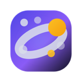
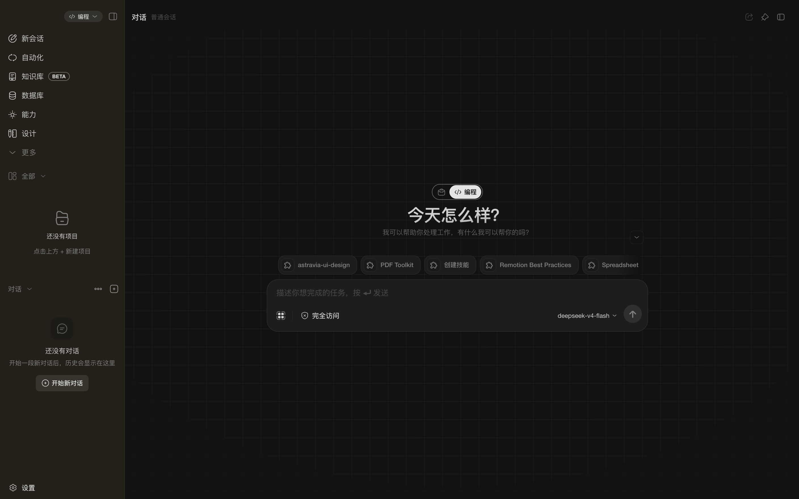
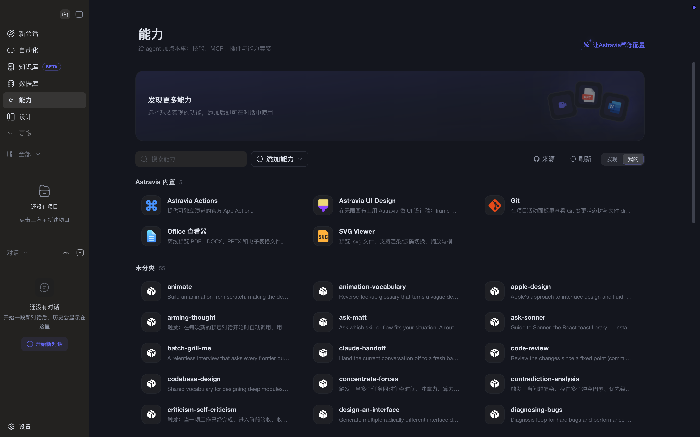
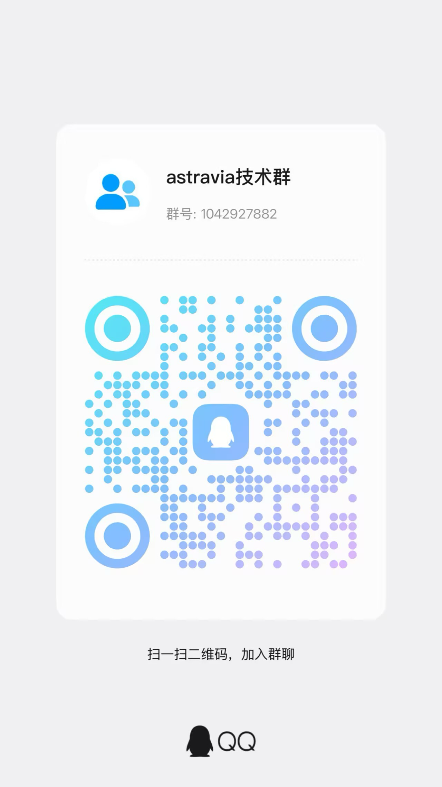

<div align="center">
  
  <h3>Astravia</h3>
  <p><strong>A local-first open-source AI desktop assistant</strong> — coding · documents · data · automation · design, all in one app</p>
  <p><a href="README.zh-CN.md">简体中文</a> · <b>English</b></p>
</div>

---

<p align="center">
  <table width="100%">
    <tr>
      <td align="center"><p><em>Main view: conversation, workspace and file preview on one screen</em></p></td>
      <td align="center"><p><em>Capabilities center: enable extensions on demand, permissions granted one by one</em></p></td>
    </tr>
  </table>
</p>

## Quick Start

1. **Download the installer** from [GitHub Releases](https://github.com/maomaochong-ai/astravia/releases) — macOS (Apple Silicon / Intel) or Windows x64
2. **Configure a model**: pick a provider in Settings and enter your own key (Claude, OpenAI, DeepSeek, Kimi, Gemini, Grok, Qwen…)
3. **Start using it**: write code, tidy documents, work on files, query databases, run batch and scheduled tasks

## Features at a Glance

### Conversation & Workspace
Message stream, tool-call progress and generated artifacts on one screen. Files preview in-app (PDF, Word, PPT, spreadsheets, images, audio, video, SVG). Scanned PDFs OCR'd offline. Built-in coding-agent reads/writes project files, runs commands and takes screenshots.

### Database Workbench
40+ database engines (PostgreSQL, MySQL, SQLite, SQL Server, Oracle, Doris, OceanBase…). SQL workbench with multi-tab queries, history, CSV/JSON export and data editing. The AI queries tables for you. Write operations need graded authorization — `prod` connections are read-only by default. The engine is dbx (Apache-2.0), shipped with the app.

### Batch Tasks & Scheduling
One prompt across many directories. Built-in cron scheduler, quiet from the tray, with run history and retry.

### Notifications & Remote Control
Batch / scheduled completion or failure pushed to Feishu / DingTalk bots (credentials stored encrypted). Remote-control your local agent from Feishu IM (Telegram and DingTalk planned).

### Ecosystem
Install skills, MCP servers, plugins and themes from any GitHub repository. Turn local documents into a searchable knowledge base — everything stays on your machine. Plugins must declare capabilities in `plugin.json`, granted individually by the host and re-checked at runtime.

### UI Design Workspace
Mockups on an infinite canvas where frames are real, runnable interfaces. One color system across the whole design. Export as render images or read-only share packages.

### Desktop Integration
A global hotkey summons the quick panel. On macOS, Appshot captures the frontmost window (screenshot, title, on-screen text) in one gesture. Configure Node / Python runtimes. Tray residency, auto-update, bilingual UI.

## Plugin Development

Astravia itself — the design canvas, Git, charts, file previewers — is all plugins. The same extension points are open to third parties. Plugins are built with Vite + Module Federation into isolated bundles; the host loads them on demand, runs them in a sandbox and validates permissions at runtime.

### What you can extend

<table width="100%">
<colgroup><col width="25%"><col width="75%"></colgroup>
<thead><tr><th>Domain</th><th>Extension points</th></tr></thead>
<tbody>
<tr><td>UI (ctx.ui)</td><td>Global floating panels, activity tabs, file previews, message cards, tool-call slots, keyboard shortcuts, notifications, file explorer toolbar and context menu</td></tr>
<tr><td>Agent (ctx.agent)</td><td>Register JS tools (JSON Schema input), dynamic system-prompt providers, Skill directory injection, inline MCP servers, continuation provider (auto follow-up at session end)</td></tr>
<tr><td>Host capabilities</td><td>File read/write (ctx.fs), command execution (ctx.command), HTTP requests (ctx.network), persistent storage (ctx.storage), settings page (ctx.settings), i18n (ctx.i18n), Official API (providers / models / MCP / batches / scheduler…)</td></tr>
<tr><td>Permission model</td><td>Every capability must be declared in plugin.json permissions. The host shows a consent dialog on install and re-checks at runtime.</td></tr>
</tbody>
</table>

### Directory layout

```
my-plugin/
├── plugin.json          # required — metadata, permissions, agent contributions
├── package.json
├── vite.config.ts       # use @astravia-org/plugin-vite's astraviaPluginFederation
├── src/
│   ├── index.tsx        # entry, exports definePlugin({ activate })
│   └── style.css
├── locales/zh.json      # optional, i18n
├── agent/
│   └── skills/          # optional, bundled skills
├── mcp.json             # optional, bundled MCP servers
└── icon.png             # optional, list display
```

### plugin.json (minimal example)

```json
{
  "id": "my-plugin",
  "name": "My Plugin",
  "version": "0.1.0",
  "pluginApiVersion": "^1.0.0",
  "runtime": "module-federation",
  "entry": "dist/mf-manifest.json",
  "moduleFederation": { "remoteName": "my_plugin", "expose": "./plugin" },
  "permissions": ["ui.slot.global", "agent.tools.register", "fs.read"],
  "agent": {
    "skillPaths": ["agent/skills/"],
    "mcpServers": {
      "my-mcp": { "type": "stdio", "command": "node", "args": ["mcp.js"] }
    }
  }
}
```

### Entry code

```tsx
import { definePlugin } from "@astravia-org/plugin-sdk";

export default definePlugin({
  activate(ctx) {
    // Extend the UI
    ctx.ui.registerActivityTab({ id: "my-tab", label: "My Panel", component: MyPanel });

    // Extend the agent: register a JS tool
    ctx.agent.registerTool({
      id: "greet",
      name: "greet_user",
      description: "Greet the user by name",
      parameters: { type: "object", properties: { name: { type: "string" } }, required: ["name"] },
      handler: async ({ trigger }) => `Hello, ${trigger.input.name}!`,
    });
  },

  deactivate() { /* optional, cleanup on uninstall */ },
});
```

### Full example: chart-renderer

This is the actual bundled chart plugin that ships with Astravia. It does two things: registers a `render_chart` JS tool (which the agent invokes to produce a Chart.js chart), and renders a chart card below the message bubble.

**Step 1 — Layout**

```
chart-renderer/
├── plugin.json
├── package.json        # deps: chart.js, react-chartjs-2
├── vite.config.ts      # astraviaPluginFederation({ name: "chart_renderer", entry: "./src/index.tsx" })
├── src/index.tsx       # definePlugin({ activate })
├── src/ChartCard.tsx   # the actual chart-card React component
├── src/ToolChartSlot.tsx
├── locales/{zh,en}.json
├── skills/chart-renderer/SKILL.md   # tells the agent when to invoke this tool
└── icon.png
```

**Step 2 — plugin.json**

```json
{
  "id": "chart-renderer",
  "name": "%plugin.name%",
  "runtime": "module-federation",
  "entry": "dist/mf-manifest.json",
  "permissions": [
    "ui.slot.tool-call",
    "agent.tools.register",
    "agent.toolHandler.execute",
    "agent.skills.control"
  ],
  "agent": { "skillPaths": ["skills/"] }
}
```

Key point: `permissions` declares only the 4 actually used — the host prompts the user for each one at install time. `skillPaths` lets the host merge SKILL.md into the agent's skill library.

**Step 3 — src/index.tsx (entry)**

```tsx
import { definePlugin } from "@astravia-org/plugin-sdk";
import { ToolChartSlot } from "./ToolChartSlot";

const parameters = {
  type: "object",
  properties: {
    type: { type: "string", enum: ["line","bar","pie","doughnut"] },
    data: { type: "object", description: "Standard Chart.js data (labels + datasets)" },
    title: { type: "string" },
    height: { type: "number", description: "Suggest 220–520" },
  },
  required: ["type", "data"],
};

export default definePlugin({
  activate(ctx) {
    // 1. Register a UI slot — when agent invokes render_chart, the host renders ToolChartSlot
    ctx.ui.registerToolCallSlot({
      id: "render-chart-tool-ui",
      toolName: "render_chart",
      component: ToolChartSlot,
    });

    // 2. Register the JS tool itself — the agent can now call it
    ctx.agent.registerTool({
      id: "chart-renderer",
      name: "render_chart",
      label: "Render Chart",
      description: "Render an interactive Chart.js chart below the message",
      parameters,
      timeoutMs: 10_000,
      handler: async ({ trigger }) => {
        const { type, data, title, height = 300 } = trigger.input ?? {};
        if (!type || !data) return { ok: false, retryable: true, error: "missing type or data" };
        return { ok: true, rendered: true, summary: `Rendered ${title ?? "chart"}` };
      },
    });
  },
});
```

How the two extension points cooperate: **`registerTool`** teaches the agent that this capability exists and how to invoke it. **`registerToolCallSlot`** tells the host "when this tool is called, render this React component". The handler never touches DOM — it returns structured data, and the host renders ToolChartSlot.

**Step 4 — Build & package**

```bash
bun install
bun run build          # Output: dist/mf-manifest.json + remoteEntry.js + style.css
zip -r chart-renderer.zip .   # Zip the whole directory
```

**Step 5 — Install into Astravia**

- Dev/debug: `bun run dev` to start the desktop app, drag the zip into **Settings → Plugins → Install local plugin**
- End users: put the zip on a GitHub Release, paste the repo URL in the plugin marketplace, the host fetches, verifies and installs.

Source lives at `packages/plugins/presets/chart-renderer/` inside the main Astravia repo — open it up and follow along.

### Build & install

```bash
# package.json
{
  "scripts": { "build": "vite build" },
  "dependencies": { "@astravia-org/plugin-sdk": "latest" },
  "devDependencies": { "@astravia-org/plugin-vite": "latest", "vite": "^7" }
}

# vite.config.ts
import { astraviaPluginFederation } from "@astravia-org/plugin-vite";
export default defineConfig({ plugins: [astraviaPluginFederation({ name: "my_plugin", entry: "./src/index.tsx" })] });
```

```bash
bun install
bun run build           # Output: dist/mf-manifest.json + dist/remoteEntry.js + dist/style.css
zip -r my-plugin.zip .  # Zip the whole plugin directory (including plugin.json)
```

Install: go to **Settings → Plugins → Install local plugin** in Astravia and pick the zip. You can also ship plugins on GitHub Releases and install them with a repository URL.

**Bundled plugins**: astravia-ui-design, content-creation, plugin-workbench, git, image-gen, chart-renderer, office-viewer, media-viewer, svg-viewer, astravia-actions.

## Model Configuration

<table width="100%">
<colgroup><col width="30%"><col width="70%"></colgroup>
<tbody>
<tr><td>Preset providers</td><td>Claude, OpenAI, DeepSeek, Z.ai, Kimi, Gemini, Grok, Qwen — baseUrl and API type only, <b>no keys at all</b></td></tr>
<tr><td>Key & model sync</td><td>Adding your key immediately pulls available models for your account; a background sync runs every 12 hours</td></tr>
<tr><td>Request path</td><td>Straight to the provider — the app never proxies, relays or bills you</td></tr>
<tr><td>Compatibility</td><td>OpenAI-compatible endpoints work too — Ollama / vLLM / LM Studio and other local runners</td></tr>
<tr><td>Metadata source</td><td>Pricing and capability data from <a href="https://models.dev">models.dev</a>, with a bundled snapshot as fallback — the app keeps working offline</td></tr>
</tbody>
</table>

## Network Behavior

The app never initiates a network call on its own — every outbound request is triggered by your explicit configuration or action. The table below lists every possible network scenario:

<table width="100%">
<colgroup><col width="15%"><col width="30%"><col width="55%"></colgroup>
<thead><tr><th>Scenario</th><th>When it happens</th><th>What exactly is sent</th></tr></thead>
<tbody>
<tr><td>LLM inference</td><td>You configured a provider and entered your API key in Settings</td><td>Requests go straight to the provider (Claude / OpenAI / DeepSeek / Kimi / Gemini / Grok / Qwen) — the app never proxies, relays or bills you. Nothing happens without a key.</td></tr>
<tr><td>Model metadata</td><td>At startup + every 12 hours in the background</td><td>Pulls pricing and capability metadata from <code>models.dev</code>. If the network fails, falls back to a bundled snapshot — no breakage.</td></tr>
<tr><td>Marketplace</td><td>You added GitHub repos as sources in Settings</td><td>Fetches Releases from the repos you specified, indexes skills / MCP servers / plugins / themes. Nothing happens with zero sources.</td></tr>
<tr><td>Automatic updates</td><td>Update source is decided by app configuration (electron-updater)</td><td>By default checks <code>latest.yml</code> / <code>latest-mac.yml</code> on Cloudflare R2. No update source configured → no checks. Only delta packages are downloaded.</td></tr>
<tr><td>MCP servers</td><td>You installed an MCP server in Settings</td><td>Spawns the process on demand (stdio or HTTP), connects to remote services with your credentials. Nothing happens with no MCP installed.</td></tr>
<tr><td>Plugins</td><td>You installed a third-party plugin in the app</td><td>Plugins can declare their own network behavior (webhooks, API calls etc.), checked at runtime by the host. Bundled plugins make no outbound network calls.</td></tr>
<tr><td>IM remote control</td><td>You enabled a Feishu bot and entered credentials in Settings</td><td>The embedded <code>im-gateway</code> Go sidecar connects to Feishu WebSocket. Nothing happens when disabled. Telegram / DingTalk planned.</td></tr>
<tr><td>OCR models</td><td>One-time download at first install build</td><td>PP-OCRv5 detection + recognition models (~100MB) are downloaded to <code>resources/ocr-models</code> and then run fully offline.</td></tr>
<tr><td>Build-time downloads</td><td>Running <code>bun run build</code> during development</td><td>Portable Python / Node.js runtimes from <code>python-build-standalone</code>; the dbx database engine binary from GitHub Releases.</td></tr>
</tbody>
</table>

## How to Develop

### Prerequisites

<table width="100%">
<colgroup><col width="20%"><col width="25%"><col width="55%"></colgroup>
<thead><tr><th>Dependency</th><th>Version</th><th>Purpose</th></tr></thead>
<tbody>
<tr><td>Bun</td><td>1.3+</td><td>Package manager and script runner — the monorepo uses Bun everywhere; npm / pnpm are not accepted</td></tr>
<tr><td>Node.js</td><td>20+</td><td>Needed for Vite frontend builds</td></tr>
<tr><td>Go</td><td>1.22+</td><td>Only required for building <code>im-gateway</code>, optional</td></tr>
<tr><td>macOS / Windows</td><td>—</td><td>Only required for building the desktop host; Linux devs can run the full core library and CLI</td></tr>
</tbody>
</table>

### One-time Setup

```bash
# 1. Clone
git clone git@github.com:maomaochong-ai/astravia.git
cd astravia

# 2. Install all dependencies (monorepo workspaces handled automatically)
bun install

# 3. (Optional) Build native modules required by the desktop app
bun run build:desktop
```

### Daily Development

```bash
# Desktop app dev mode (hot reload + DevTools)
bun run dev

# Terminal CLI dev mode
bun run dev:cli

# Run unit tests for one package only
bun run test:pkg ai          # test:pkg --list to see all packages
```

### Before Submitting

```bash
# Full quality gate (required before opening a PR; blocks commit on failure)
bun run check
#   Includes: Biome lint + TypeScript typecheck + architecture guard (one-way deps)
#             + secret key detection + conflict marker detection

# Fast feedback on changed files (saves time)
bun run check:quick

# Only unit-test packages touched by your diff
bun run test:changed
```

### Commit Conventions

<table width="100%">
<colgroup><col width="25%"><col width="75%"></colgroup>
<thead><tr><th>Rule</th><th>Detail</th></tr></thead>
<tbody>
<tr><td>Package manager</td><td>Bun only; no <code>package-lock.json</code> or <code>pnpm-lock.yaml</code></td></tr>
<tr><td>TypeScript</td><td>No unnecessary <code>any</code>; all type errors must be fixed to pass <code>bun run check</code></td></tr>
<tr><td>i18n</td><td>All user-facing copy must go through i18n; hard-coding strings in components is a violation</td></tr>
<tr><td>Commit messages</td><td>In Chinese, prefixed with <code>feat:</code> / <code>fix:</code> / <code>docs:</code> / <code>refactor:</code> / <code>chore:</code>; reference issues with <code>fixes #N</code> / <code>closes #N</code></td></tr>
</tbody>
</table>

Full rules in [AGENTS.md](AGENTS.md).

### Optional Module Builds

```bash
# CLI wrapper
bun run build:cli

# IM sidecar (Go, independent Makefile)
cd packages/im-gateway && make build

# OCR models (auto-downloaded on first build)
bun run prepare:ocr-models
```

## Architecture

Monorepo. **Dependencies flow strictly downward**: host apps → runtime adapters → AI/agent kernel. Core libraries have no awareness of the host — the same kernel runs in the Electron desktop app and in a terminal CLI.

```
astravia/
├── packages/
│   ├── ai                     — Multi-provider LLM adapters (Claude / OpenAI / DeepSeek / Kimi / ...)
│   ├── agent                  — Agent loop, session management, tool dispatch
│   ├── coding-agent           — Coding agent: reads/writes project files, runs commands, takes screenshots
│   ├── ecosystem-adapter      — Runtime adapter for marketplace, plugins and skills
│   ├── runtime-core           — Host-shared adapter layer: config dir, credential store, event bus
│   ├── runtime-tools          — Host-shared adapter layer: filesystem, command execution, network
│   ├── runtime-storage        — Host-shared adapter layer: session persistence, workspace index
│   ├── runtime-mcp            — MCP server lifecycle management
│   ├── runtime-telemetry      — Telemetry (disk-only, never sent)
│   ├── desktop-app            — Electron desktop host (macOS / Windows native signed)
│   ├── cli-app                — Terminal CLI host
│   ├── im-gateway             — Go IM sidecar (Feishu, starts and stops with the app)
│   ├── ui                     — React component primitives
│   ├── theme-ui               — Themed UI components
│   ├── theme-sdk              — Theme SDK (color tokens, component override points)
│   ├── plugins                — Bundled plugins (UI design, content creation, Git, charts, preview…)
│   ├── skill-presets          — Bundled skill presets
│   ├── themes                 — Bundled themes
│   ├── capability-sdk         — Capability and permission definition SDK
│   ├── capability-runtime     — Capability runtime (permission checks, capability orchestration)
│   ├── action-rpc             — Agent ↔ Desktop RPC protocol
│   └── toolkit                — Dev utilities
├── docs/                      — Architecture docs and ADRs
└── scripts/                   — Build, release and quality guards
```

**Dependency direction**:

<table width="100%">
<colgroup><col width="40%"><col width="60%"></colgroup>
<thead><tr><th>Chain</th><th>Detail</th></tr></thead>
<tbody>
<tr><td><code>desktop-app</code> / <code>cli-app</code> → <code>runtime-*</code> → <code>coding-agent</code> / <code>agent</code> / <code>ai</code></td><td>Hosts never call the AI layer directly — always injected through the runtime adapter layer</td></tr>
<tr><td><code>ai</code> ← <code>agent</code> ← <code>coding-agent</code></td><td>Upper packages hold lower capabilities; coding-agent is the topmost business package</td></tr>
<tr><td><code>runtime-*</code> has no dependency on the AI layer</td><td>Runtimes only adapt host capabilities; <code>capability-*</code> spans layers for permission definitions</td></tr>
<tr><td><code>plugins</code> / <code>skill-presets</code> / <code>themes</code></td><td>Pure resource bundles with no runtime dependency</td></tr>
</tbody>
</table>

## Join the Community

<p align="center" style="color:#656d76;font-size:14px;margin-bottom:20px;">Scan the QR code, share feedback and get the latest updates</p>

<div align="center">
  <table width="100%" style="border-collapse:separate;border-spacing:16px 0;">
    <tr>
      <td align="center" style="border:1px solid #d0d7de;border-radius:12px;padding:20px 16px;background:#f6f8fa;vertical-align:top;">
        <div style="display:inline-block;padding:3px 10px;border-radius:20px;background:#12b7f5;color:#fff;font-size:12px;font-weight:600;margin-bottom:12px;">QQ</div><br />
        <br />
        <p style="margin:12px 0 0 0;font-weight:600;font-size:15px;">QQ Official Group</p>
        <p style="margin:4px 0 0 0;color:#656d76;font-size:13px;">Chat · Bug reports</p>
      </td>
      <td align="center" style="border:1px solid #d0d7de;border-radius:12px;padding:20px 16px;background:#f6f8fa;vertical-align:top;">
        <div style="display:inline-block;padding:3px 10px;border-radius:20px;background:#07c160;color:#fff;font-size:12px;font-weight:600;margin-bottom:12px;">WeChat</div><br />
        <br />
        <p style="margin:12px 0 0 0;font-weight:600;font-size:15px;">WeChat Official Group</p>
        <p style="margin:4px 0 0 0;color:#656d76;font-size:13px;">Updates · Beta recruiting</p>
      </td>
    </tr>
  </table>
</div>

## Credits

<table width="100%">
<thead><tr><th>Project</th><th>Used for</th><th>License</th></tr></thead>
<tbody>
<tr><td><a href="https://github.com/badlogic/pi-mono">pi</a> · Mario Zechner</td><td><code>ai</code>, <code>agent</code>, <code>coding-agent</code>, <code>ecosystem-adapter</code> are derived from this project and have been rewritten and extended. The agent loop, provider abstraction and extension mechanism all originate here.</td><td>MIT</td></tr>
<tr><td><a href="https://github.com/openai/codex">Codex CLI</a> · OpenAI</td><td>Execution sandbox design draws on this project; the Windows sandbox host binary is distributed with the app.</td><td>Apache-2.0</td></tr>
<tr><td><a href="https://github.com/containers/bubblewrap">bubblewrap</a></td><td>Linux sandbox backend <code>bwrap</code>, shipped with the Linux installer.</td><td>LGPL-2.0+</td></tr>
<tr><td><a href="https://github.com/PaddlePaddle/PaddleOCR">PP-OCRv5</a> · PaddlePaddle</td><td>Offline PDF OCR detection + recognition models (<code>ppocrv5_det.onnx</code> / <code>ppocrv5_rec.onnx</code>).</td><td>Apache-2.0</td></tr>
<tr><td><a href="https://github.com/astral-sh/python-build-standalone">python-build-standalone</a></td><td>Portable Python runtime, downloaded and provisioned on demand.</td><td>PSF / mixed</td></tr>
<tr><td><a href="https://nodejs.org">Node.js</a></td><td>Portable Node runtime, downloaded and provisioned on demand.</td><td>MIT</td></tr>
</tbody>
</table>

Thanks also to the [Model Context Protocol](https://modelcontextprotocol.io) specification, the [models.dev](https://models.dev) catalog, and the Electron, React, Vite, Tailwind CSS, shadcn/ui and Bun projects. Full third-party inventory in [NOTICE](NOTICE).

## License

[Apache-2.0](LICENSE)
