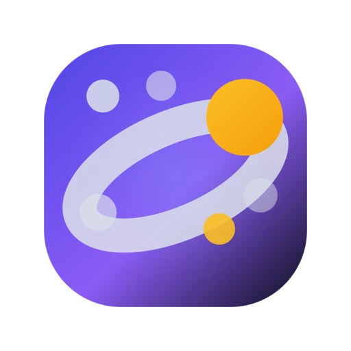

<p align="center">
  
</p>

<h1 align="center">Astravia · 星轨</h1>

<p align="center">
  面向真实工作的开源桌面 AI Agent——本地优先、可扩展，由你掌控。
</p>

<p align="center">
  <a href="https://www.astravia.dev"></a>
  <a href="LICENSE"></a>
  
</p>

<p align="center">
  <b>简体中文</b> ·
  <a href="README.zh-CN.md">English</a> ·
  <a href="https://www.astravia.dev/download">下载</a>
</p>

---

Astravia 把模型、项目文件、本机工具和可复用能力放进同一个桌面工作区。它适用于编码、文档、数据、研究、创意生产和可重复工作流，同时让工作继续发生在你选择的环境中。

它不只是聊天界面：Astravia 能理解工作区、在可见的权限边界内调用工具、交付真实文件，并保留可供检查的执行过程。

<p align="center">
  
</p>

## 为什么选择 Astravia

| | 对你意味着什么 |
|---|---|
| **本地优先的工作区** | 项目、会话、文件与执行过程留在你选择的环境中。 |
| **自带模型** | 通过 BYOK 连接受支持的 Provider、OpenAI 兼容端点或本地推理服务。 |
| **真实工具与产物** | 在同一条任务流中处理代码、文档、表格、媒体、命令和生成文件。 |
| **过程可检查** | 工具调用、计划、权限、进度、结果和恢复路径都有记录。 |
| **方法可复用** | 使用技能、MCP、插件、主题、知识库、批量任务和自动化持续积累能力。 |
| **开放的客户端栈** | 桌面端、CLI、SDK、插件系统、主题、移动端与 IM 网关都在本仓库开发。 |

## 从这里开始

| 我想要…… | 从这里开始 |
|---|---|
| 使用桌面应用 | [下载 macOS、Windows 或 Linux 客户端](https://www.astravia.dev/download)，完成应用内首次设置。 |
| 理解产品能力 | 阅读下面的核心能力介绍。 |
| 开发扩展 | 跳转到 [插件开发](#插件开发)。 |
| 参与代码开发 | 阅读 [`QUICKSTART.zh-CN.md`](QUICKSTART.zh-CN.md) 与 [`CONTRIBUTING.zh-CN.md`](CONTRIBUTING.zh-CN.md)。 |

### 从源码运行

需要 **Bun 1.3+** 与 **Node.js 20+**。

```bash
git clone git@github.com:maomaochong-ai/open-astravia.git
cd open-astravia
git switch dev
bun install
cd apps/desktop
bun run dev
```

开发应用默认使用 `~/.astravia-dev`，不会改动正式安装版位于 `~/.astravia` 的数据。仓库根目录的 `bun run dev` 只监听核心库，不会启动 Electron。完整环境准备与检查命令见 [`QUICKSTART.zh-CN.md`](QUICKSTART.zh-CN.md)。

## 可以用它做什么

- **在项目和会话中工作。** 把任务历史、文件、上下文、产物和执行详情放在一起。
- **使用本机与外部工具。** 运行命令、检查文件、连接 MCP 服务，并显式批准敏感操作。
- **处理专业产物。** 预览和处理源码、PDF、Office 文件、表格、图片、音视频、SVG 与生成式 UI。
- **放大已经跑通的任务。** 用批量任务处理多个目录，或把稳定流程交给自动化定时执行。
- **复用组织知识。** 建立本地知识库，安装可复用的技能和场景。
- **离开电脑也能继续。** 使用受支持的 IM 桥接、Webhook、通知、快捷输入和桌面原生集成。

## 核心能力

### 对话与工作区
消息流、工具调用、生成结果同屏可见；文件在应用内直接预览（PDF、Word、PPT、表格、图片、音视频、SVG）；扫描版 PDF 离线 OCR。内置 coding-agent 可读写工程文件、运行命令、截图。

### 数据库工作台
内置 40+ 数据库连接（PostgreSQL、MySQL、SQLite、SQL Server、Oracle、Doris、OceanBase…），SQL 工作台多标签查询、历史记录、CSV/JSON 导出；AI 可在对话中直接查数；写操作分级授权，prod 连接默认只读。

### 批量任务 & 定时调度
一个 Prompt 对多目录批量执行；内置 Cron 调度，托盘后台运行，历史可查、可重试。

### 通知与远程控制
批量 / 定时任务完成或异常推送飞书、钉钉机器人（凭据本地加密）；飞书 IM 遥控本机 Agent（Telegram、钉钉规划中）。

### 扩展生态
从 GitHub 仓库安装 Skill、MCP Server、插件与主题；本地文档加工成可检索知识库，全程不出本机。插件权限系统：每项能力必须声明权限，宿主单独授权、运行时校验。

### UI 设计工作区
无限画布上的设计稿即真实可运行界面，共享色彩系统，可导出渲染图或只读分享包。

### 桌面集成
全局快捷键唤起快捷面板；macOS Appshot 手势截图 + 屏上文字交给 Agent；Node / Python 运行时配置；托盘常驻；electron-updater 自动更新；中英双语界面。

## 插件开发

Astravia 自身的设计画布、Git、图表、文件预览都是插件，同一套扩展点对第三方开放。插件用 Vite + Module Federation 构建成独立 bundle，宿主运行时按需加载、沙箱执行、权限校验。

### 能扩展什么

| 域 | 可用扩展点 |
|---|---|
| **界面 (ctx.ui)** | 全局悬浮面板、活动面板标签、文件预览器、消息卡片、工具调用插槽、快捷键、通知、文件浏览器工具栏与右键菜单 |
| **Agent (ctx.agent)** | 注册 JS 工具（JSON Schema 入参）、动态系统提示词 provider、Skill 目录注入、MCP Server 随插件声明、Continuation provider（会话尾自动追问） |
| **宿主能力** | 文件读写 (ctx.fs)、命令执行 (ctx.command)、HTTP 请求 (ctx.network)、持久化存储 (ctx.storage)、设置页 (ctx.settings)、i18n (ctx.i18n)、官方 API（模型 / 提供商 / MCP / 批量 / 调度…） |
| **权限系统** | 每项能力都必须在 plugin.json 的 permissions 中声明，宿主安装时弹窗让用户逐条授权，运行时再次校验 |

### 目录结构

```
my-plugin/
├── plugin.json          ← 必须，声明元数据、权限、Agent 贡献路径
├── package.json
├── vite.config.ts       ← 用 @astravia-org/plugin-vite 的 astraviaPluginFederation
├── src/
│   ├── index.tsx        ← 入口，导出 definePlugin({ activate })
│   └── style.css
├── locales/zh.json      ← 可选，i18n 文案
├── agent/
│   └── skills/          ← 可选，随插件打包的 Skill
├── mcp.json             ← 可选，随插件声明的 MCP Server
└── icon.png             ← 可选，列表展示用
```

### 入口代码

```tsx
import { definePlugin } from "@astravia-org/plugin-sdk";

export default definePlugin({
  activate(ctx) {
    ctx.ui.registerActivityTab({ id: "my-tab", label: "我的面板", component: MyPanel });

    ctx.agent.registerTool({
      id: "greet",
      name: "greet_user",
      description: "向用户打招呼",
      parameters: { type: "object", properties: { name: { type: "string" } }, required: ["name"] },
      handler: async ({ trigger }) => `Hello, ${trigger.input.name}!`,
    });
  },

  deactivate() { /* 可选，卸载时清理 */ },
});
```

### 构建与安装

```bash
# package.json
{
  "scripts": { "build": "vite build" },
  "dependencies": { "@astravia-org/plugin-sdk": "latest" },
  "devDependencies": { "@astravia-org/plugin-vite": "latest", "vite": "^7" }
}

# vite.config.ts
import { astraviaPluginFederation } from "@astravia-org/plugin-vite";
export default defineConfig({ plugins: [astraviaPluginFederation({ name: "my_plugin", entry: "./src/index.tsx" })] });
```

```bash
bun install
bun run build           # 产物：dist/mf-manifest.json + dist/remoteEntry.js + dist/style.css
zip -r my-plugin.zip .  # 打包整个插件目录（含 plugin.json）
```

安装：在 Astravia 内「设置 → 插件 → 安装本地插件」选择 zip 即可。也可以把插件放到 GitHub Release，用仓库 URL 在应用内一键安装。

**内置插件**：astravia-ui-design、content-creation、plugin-workbench、git、image-gen、chart-renderer、office-viewer、media-viewer、svg-viewer、astravia-actions。

## 数据与构建模式

源码检出默认生成 **lite** 构建，不依赖托管后端：不要求账号、订阅、远程管理或托管市场。模型请求直达你配置的端点，凭据保存在本地凭据存储中。

本地优先不等于完全没有网络流量。模型 Provider、MCP、插件、Webhook、IM、更新源和可选遥测分别形成自己的数据边界。

## 仓库结构

本仓库是 Bun/TypeScript Monorepo，同时包含 Swift、Kotlin 与 Go 应用。依赖从应用指向可复用包，`packages/*` 不反向依赖 `apps/*`。

| 范围 | 职责 |
|---|---|
| [`apps/desktop`](apps/desktop) | Electron 桌面宿主与渲染层 |
| [`apps/cli-host`](apps/cli-host) | Coding Agent 的 CLI 宿主 |
| [`apps/docs-site`](apps/docs-site) | 文档站 |
| [`apps/mobile/client-apple`](apps/mobile/client-apple) | Swift/SwiftUI 原生 iOS 客户端 |
| [`apps/mobile/client-android`](apps/mobile/client-android) | Kotlin Multiplatform Android 客户端 |
| [`apps/im-gateway`](apps/im-gateway) | Go 编写的 IM 旁路网关 |
| [`packages/ai`](packages/ai) · [`packages/agent`](packages/agent) | Provider 抽象与 Agent Loop |
| [`packages/coding-agent`](packages/coding-agent) · `packages/runtime-*` | 产品组合、运行时合同、工具、存储、MCP 与宿主适配 |
| [`packages/plugins`](packages/plugins) · [`packages/themes`](packages/themes) | 扩展 SDK、内置扩展与主题 |

架构细节与公共集成合同见 [`docs/adr/`](docs/adr/)。

## 开发与贡献

统一使用 Bun 和仓库脚本；不要在这个 Monorepo 中运行裸 `bun test`。

```bash
bun run check:quick              # 检查改动文件与架构边界
bun run check                    # 完整 lint、类型和架构守卫
bun run test:pkg <package-name>  # 定向包测试
bun run test:changed             # 运行当前 diff 影响的测试
```

Pull Request 发往 **`dev`** 分支。贡献地图、测试要求与评审门槛见 [`CONTRIBUTING.zh-CN.md`](CONTRIBUTING.zh-CN.md)。架构和 Agent 协作规则见 [`AGENTS.md`](AGENTS.md)。

问题和早期想法请发到 GitHub Discussions。安全漏洞请通过 GitHub Security Advisories 私下报告。

## 加入社群

<p align="center" style="color:#656d76;font-size:14px;margin-bottom:20px;">扫码加入，交流使用经验、反馈问题、获取最新动态</p>

<p align="center">
  <table width="100%" style="border-collapse:separate;border-spacing:16px 0;">
    <tr>
      <td align="center" style="border:1px solid #d0d7de;border-radius:12px;padding:20px 16px;background:#f6f8fa;vertical-align:top;">
        <div style="display:inline-block;padding:3px 10px;border-radius:20px;background:#12b7f5;color:#fff;font-size:12px;font-weight:600;margin-bottom:12px;">QQ</div><br />
        <br />
        <p style="margin:12px 0 0 0;font-weight:600;font-size:15px;">QQ 官方群</p>
        <p style="margin:4px 0 0 0;color:#656d76;font-size:13px;">日常交流 · 问题反馈</p>
      </td>
      <td align="center" style="border:1px solid #d0d7de;border-radius:12px;padding:20px 16px;background:#f6f8fa;vertical-align:top;">
        <div style="display:inline-block;padding:3px 10px;border-radius:20px;background:#07c160;color:#fff;font-size:12px;font-weight:600;margin-bottom:12px;">微信</div><br />
        <br />
        <p style="margin:12px 0 0 0;font-weight:600;font-size:15px;">微信官方群</p>
        <p style="margin:4px 0 0 0;color:#656d76;font-size:13px;">版本更新 · 内测招募</p>
      </td>
    </tr>
  </table>
</p>

## 致谢与许可

Astravia 建立在广泛的开源生态之上，包括 pi、Codex CLI、MCP、Electron、React、Bun、models.dev，以及 [`NOTICE`](NOTICE) 中列出的项目。完整第三方清单与原始版权声明以该文件为准。

本项目采用 [Apache-2.0](LICENSE) 许可。
